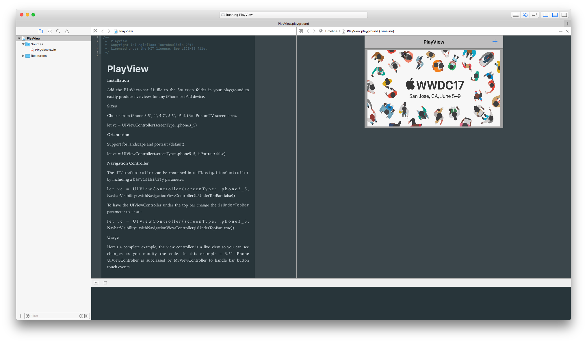

# 📱PlayView

Welcome to PlayView, a more convenient way to have a View Controller in whatever size you want inside a Swift Playground.

Even though inside an Xcode project it's easy to change the dimensions & the orientation of a View Controller, inside a playground it's the exact opposite and this is exactly what PlayView makes so simple.



## Usage

Choose from iPhone 3.5", 4", 4.7", 5.5", iPad, iPad Pro, or TV screen sizes.

```swift
let vc = UIViewController(screenType: .phone3_5)
```
Support for landscape and portrait (default).

```swift
let vc = UIViewController(screenType: .phone5_5, isPortrait: false)
```
**Navigation Controller**

The `UIViewController` can be contained in a `UINavigationController` by including a `NavbarVisibility` parameter.

```swift
let vc = UIViewController(screenType: .phone3_5, NavbarVisibility: .withNavigationViewController(isUnderTopBar: false))
```
 To have the UIViewController under the top bar change the `isUnderTopBar` parameter to `true`:

 ```swift
 let vc = UIViewController(screenType: .phone3_5, NavbarVisibility: .withNavigationViewController(isUnderTopBar: true))
 ```
 Here's a complete example, the view controller is a live view so you can see changes as you modify the code. In this example a 3.5" iPhone UIViewController is subclassed by MyViewController to handle bar button touch events.

 ```swift
 import UIKit

 class MyViewController: UIViewController {
   func tapped(sender: AnyObject) {
     print("bar button tapped")
   }
 }

 let vc = MyViewController(screenType: .phone3_5, isPortrait: false, NavbarVisibility: .withNavigationViewController(isUnderTopBar: false))

 let image = #imageLiteral(resourceName: "wwdc17.jpg")
 let imageView = UIImageView(image: image)
 imageView.frame = CGRect(x: 10, y: 5, width: 460, height: 266)

 let barButton = UIBarButtonItem(barButtonSystemItem: .add, target: vc, action: #selector(vc.tapped(sender:)))

 vc.view.addSubview(imageView)
 vc.navigationItem.rightBarButtonItem = barButton
 vc.title = "PlayView"
 vc.view.backgroundColor = .lightGray
 ```
## Installation

 Add the `PlayView.swift` file to the `Sources` folder in your playground to **easily** produce live views for any iPhone or iPad device.

 ## Help, feedback or suggestions?

- [Open an issue](https://github.com/agisilaos/PlayView/issues/new) if you need help, if you found a bug, or if you want to discuss a feature request.
- [Open a PR](https://github.com/agisilaos/PlayView/pull/new/master) if you want to make some change to PlayView.
- Contact [@agisilaosts on Twitter](https://twitter.com/agisilaosts) for discussions, news & announcements about PlayView & other projects.
